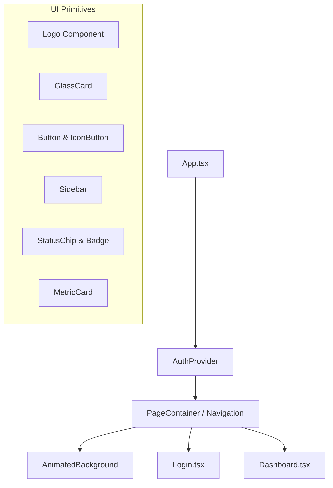

# Implementation Plan - Reflexion Visual Identity Overhaul

This plan outlines the visual redesign of Reflexion to transform it into a premium, calm, and highly technical "Mission Control for Autonomous Software Engineers."

---

## Proposed Design System

### 1. Typography & Fonts
- **Body Font:** Geist Sans (Imported via JSDelivr CDN)
- **Headings Font:** General Sans (Imported via Fontshare CDN)
- **Code Font:** JetBrains Mono (Imported via Google Fonts CDN)

### 2. Color Palette (CSS Variables)
- `--bg-primary`: Deep Graphite (`#08080c`)
- `--surface-layer-1`: Slightly lighter dark surface (`#0d0d12`)
- `--surface-layer-2`: Elevated glass surface (`rgba(20, 20, 28, 0.4)`)
- `--border-subtle`: Subtle white transparency (`rgba(255, 255, 255, 0.05)`)
- `--accent-indigo`: Electric Indigo (`#6366f1`)
- `--accent-cyan`: Soft Cyan (`#22d3ee`)
- `--color-success`: Emerald (`#10b981`)
- `--color-warning`: Amber (`#f59e0b`)
- `--color-error`: Muted Red (`#ef4444`)
- `--text-title`: General Sans Heading Text (`#fafafa`)
- `--text-body`: Geist Sans Body Text (`#d4d4d8`)
- `--text-muted`: Muted Helper Text (`#71717a`)

### 3. Motion System (Framer Motion)
- **Page Transitions:** Smooth page fade and slight slide-up on enter.
- **Sidebar:** Animate sidebar contraction/expansion with elastic layout transitions.
- **Interactive States:** Hover scale, active press, and smooth loading state spinner animations.
- **Lifecycle Animation:** A continuous sequence loop visualizing the `Observe -> Plan -> Code -> Test -> Reflect -> Improve` stages on the landing page.

---

## Proposed Changes

### Component Architecture

---

## Detailed File Modifications

### 1. Installation of Dependencies
- Add `framer-motion` to `frontend/package.json` and install.

### 2. Global Styles & Design System
#### [MODIFY] [index.css](file:///c:/Users/Dhivya%20Prabha/Desktop/Projects/Reflexion/frontend/src/index.css)
- Reset styles to utilize CSS variables for layout, typography, borders, and colors.
- Define a modern global CSS noise overlay.
- Configure background animated classes using CSS keyframe-based transforms.

### 3. UI Primitives
#### [NEW] [Logo.tsx](file:///c:/Users/Dhivya%20Prabha/Desktop/Projects/Reflexion/frontend/src/components/ui/Logo.tsx)
- Custom abstract geometric SVG logo representing iteration and feedback loops (intersecting, rotating rings with a center core).

#### [NEW] [Button.tsx](file:///c:/Users/Dhivya%20Prabha/Desktop/Projects/Reflexion/frontend/src/components/ui/Button.tsx)
- Reusable, customizable button and icon buttons with Framer Motion interactive lift/press animations.

#### [NEW] [GlassCard.tsx](file:///c:/Users/Dhivya%20Prabha/Desktop/Projects/Reflexion/frontend/src/components/ui/GlassCard.tsx)
- Glassmorphic card container utilizing sub-layer blur filters and transparent borders.

#### [NEW] [StatusChip.tsx](file:///c:/Users/Dhivya%20Prabha/Desktop/Projects/Reflexion/frontend/src/components/ui/StatusChip.tsx)
- Reusable badge and chip design for repository status, task attempts, or health states.

#### [NEW] [AnimatedBackground.tsx](file:///c:/Users/Dhivya%20Prabha/Desktop/Projects/Reflexion/frontend/src/components/ui/AnimatedBackground.tsx)
- Renders the noise overlay, slow-moving indigo/cyan radial gradient lights, and low-opacity blur circles.

### 4. Overhaul Core Views
#### [MODIFY] [Login.tsx](file:///c:/Users/Dhivya%20Prabha/Desktop/Projects/Reflexion/frontend/src/components/Login.tsx)
- Apply the dark, deep-graphite theme layout.
- Render the custom logo, headline, subheadline, and supporting text.
- Re-design the CTA "Continue with GitHub" button to include Framer Motion hover behaviors and a loading state.
- Build the **Engineering Lifecycle Animation Indicator** showing the stages dynamically looping.

#### [MODIFY] [Dashboard.tsx](file:///c:/Users/Dhivya%20Prabha/Desktop/Projects/Reflexion/frontend/src/components/Dashboard.tsx)
- Re-design the sidebar to use a dark translucent glass design with responsive collapsible views.
- Lay out the main workspace with metric card grid columns, section headers, and empty state modules.
- Preserve all existing routes, local storage states, and API profiles/endpoints.

#### [MODIFY] [index.html](file:///c:/Users/Dhivya%20Prabha/Desktop/Projects/Reflexion/frontend/index.html)
- Inject JSDelivr, Google Fonts, and Fontshare links to import Geist Sans, General Sans, and JetBrains Mono.

---

## Verification Plan

### Automated Tests
- Run `npm run build` to confirm compiler compatibility.

### Manual Verification
- Launch the browser subagent to navigate to `/` and `/dashboard` to capture the layout, visual design, and confirm everything rendering.
- Verify that logging in and logging out preserves session states.
- Confirm uvicorn / main FastAPI routers remain unaffected.
